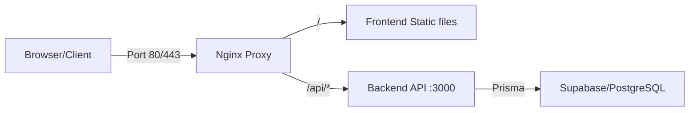

# 🚀 Nginx Reverse Proxy Implementation

This project implements a Production-Ready architecture using Nginx as a reverse proxy for a Fullstack application (Quasar Frontend + Node.js Backend).

## 📊 Architecture



## ✨ Features

- **Single Entry Point**: Everything through Port 80/443.
- **Performance**: Gzip compression and static asset caching enabled.
- **Security**: Pre-configured security headers (X-Frame-Options, CSP, etc.).
- **SSL Ready**: Template provided for easy HTTPS setup.
- **Automated Deployment**: Simple scripts for build and deployment.

## 🚀 Quick Start

### 1. Build & Deploy (Development/Local)
```batch
deploy.bat
```

### 2. Check Status
```batch
status.bat
```

### 3. Test API
```batch
test-api.bat
```

## 📁 Key Files

- `nginx/nginx.conf`: Main Nginx configuration.
- `nginx/conf.d/app.conf`: Routing rules and proxy settings.
- `docker-compose.yml`: Main container orchestration.
- `deploy.bat`: Automated build and deployment script.

## 📚 Documentation

- [NGINX-SETUP.md](NGINX-SETUP.md): Detailed configuration and extension guide.
- [TESTING-CHECKLIST.md](TESTING-CHECKLIST.md): Verification and testing steps.
- [IMPLEMENTATION-COMPLETE.md](IMPLEMENTATION-COMPLETE.md): Detailed report of changes.

---
**Status**: ✅ Production Ready
